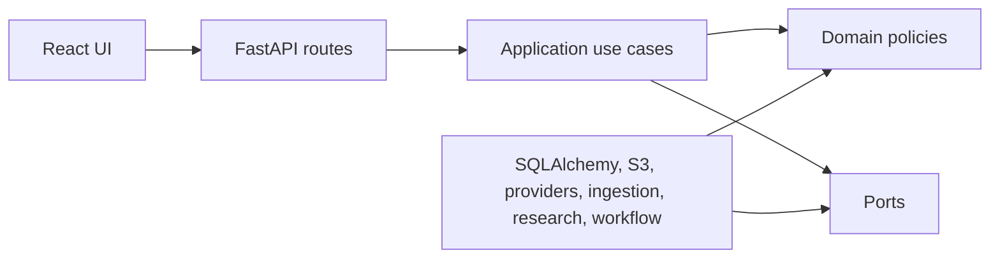

# Stage 2 Architecture Decision Summary

## Summary

RedTeamAgent remains a local-first modular monolith with a React/Vite frontend and FastAPI backend. Stage 2 broadens the vertical slice into richer decision support: more source types, public website and repository ingestion, explicit external research, expanded provider adapters, full specialist routing, advanced reports and deterministic evaluation. The backend still separates domain policy, application use cases, interface adapters and infrastructure so provider, storage, search, ingestion, workflow, research and export implementations can be replaced through contracts.

## Key Decisions

- Use FastAPI, Pydantic and SQLAlchemy for a typed API and persistence layer.
- Use PostgreSQL with the `pgvector` image in Docker Compose, while tests use isolated SQLite databases.
- Use Redis as the Stage 1 queue/event deployment dependency and keep an in-process background workflow runner for deterministic local tests.
- Store source originals behind an object-storage port with MinIO-compatible S3 in local development.
- Use deterministic provider contracts, a registry and typed adapter configuration schemas.
- Add deterministic local contracts for OCR, transcription, repository indexing, website snapshots, external research, reranking and evaluation so CI never needs live provider credentials.
- Use HttpOnly cookie sessions, Argon2id password hashing and CSRF protection for cookie-authenticated mutations.
- Treat all uploaded material, website content, repository content, OCR text, transcripts, search results and model output as untrusted evidence.
- Store reports, findings, evidence gaps and provider routing as structured data before rendering.
- Keep Stage 2 integrations defensive by default: no code execution, no private-network website fetches, no sensitive source text in external queries without explicit permission and no claim of professional sign-off.

## Dependency Direction

Domain and application code must not import FastAPI, SQLAlchemy ORM models, Celery, React or vendor model SDKs.
