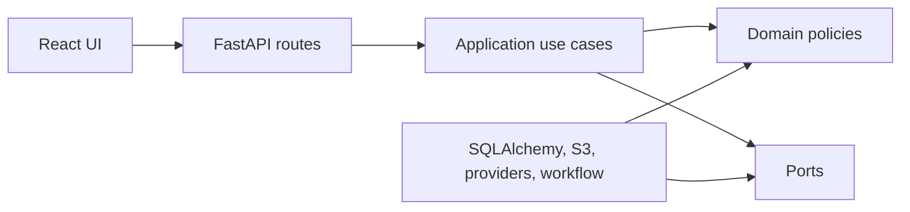

# Stage 1 Architecture Decision Summary

## Summary

RedTeamAgent is implemented as a local-first modular monolith with a React/Vite frontend and FastAPI backend. It red-teams decision-making artefacts of any kind, not primarily source code: proposals, essays, project plans, policies, product choices, code changes and other evidence-backed decisions should all fit the same workflow. The backend separates domain policy, application use cases, interface adapters and infrastructure so that provider, storage, ingestion, workflow and export implementations can be replaced through contracts.

## Key Decisions

- Use FastAPI, Pydantic and SQLAlchemy for a typed API and persistence layer.
- Use PostgreSQL with the `pgvector` image in Docker Compose, while tests use isolated SQLite databases.
- Use Redis as the Stage 1 queue/event deployment dependency and keep an in-process background workflow runner for deterministic local tests.
- Store source originals behind an object-storage port with MinIO-compatible S3 in local development.
- Use deterministic provider contracts, a registry and typed adapter configuration schemas.
- Use HttpOnly cookie sessions, Argon2id password hashing and CSRF protection for cookie-authenticated mutations.
- Treat all uploaded material and model output as untrusted evidence.
- Store reports, findings, evidence gaps and provider routing as structured data before rendering.

## Dependency Direction

Domain and application code must not import FastAPI, SQLAlchemy ORM models, Celery, React or vendor model SDKs.
