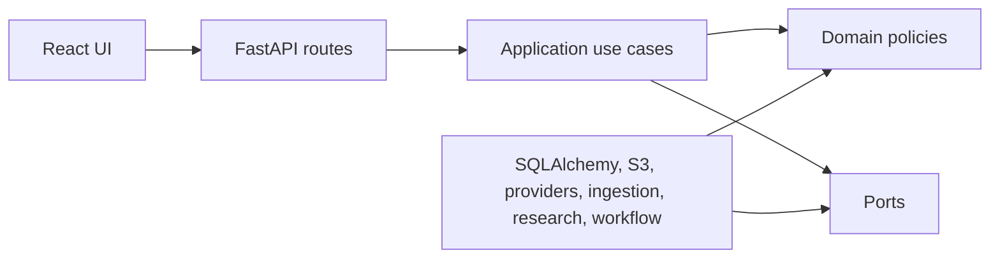

# Stage 3 Architecture Decision Summary

## Summary

RedTeamAgent remains a local-first modular monolith with a React/Vite frontend and FastAPI backend. Stage 3 adds organisation workspaces, enterprise administration, central provider governance, retention, report sharing, API/webhook integration, scheduled re-review and operational hardening without changing the dependency direction established in Stages 1 and 2.

Enterprise behaviour lives behind dedicated application services and persistence adapters. Existing project, review, provider and workflow routes keep their public contracts, while provider governance is enforced through deterministic application policy before provider connections, model records or review runs can proceed.

## Key Decisions

- Use FastAPI, Pydantic and SQLAlchemy for a typed API and persistence layer.
- Use PostgreSQL with the `pgvector` image in Docker Compose, while tests use isolated SQLite databases.
- Use Redis as the Stage 1 queue/event deployment dependency and keep an in-process background workflow runner for deterministic local tests.
- Store source originals behind an object-storage port with MinIO-compatible S3 in local development.
- Use deterministic provider contracts, a registry and typed adapter configuration schemas.
- Add deterministic local contracts for OCR, transcription, repository indexing, website snapshots, external research, reranking and evaluation so CI never needs live provider credentials.
- Use HttpOnly cookie sessions, Argon2id password hashing and CSRF protection for cookie-authenticated mutations.
- Treat all uploaded material, website content, repository content, OCR text, transcripts, search results and model output as untrusted evidence.
- Store reports, findings, evidence gaps and provider routing as structured data before rendering.
- Keep Stage 2 integrations defensive by default: no code execution, no private-network website fetches, no sensitive source text in external queries without explicit permission and no claim of professional sign-off.
- Keep Stage 3 enterprise persistence in separate adapters so the Stage 1/2 repository does not become a god object.
- Centralise organisation RBAC, project-level permissions and provider governance in application services.
- Store API tokens as one-way hashes with prefix metadata only. Return the plaintext token once at creation.
- Use HMAC webhook signatures with timestamp tolerance and replay checks before accepting delivery callbacks.
- Treat custom agents, rubrics and templates as administrator-approved structured configuration, never as permission-bearing instructions.
- Document audit tamper evidence as a production storage control unless the local SQLite deployment is replaced by append-only audit storage.

## Dependency Direction

Domain and application code must not import FastAPI, SQLAlchemy ORM models, Celery, React or vendor model SDKs.
