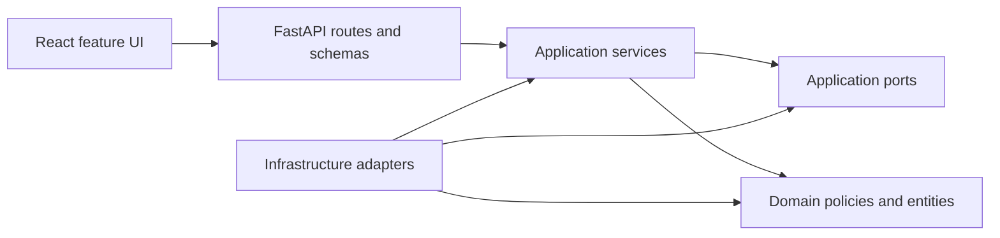
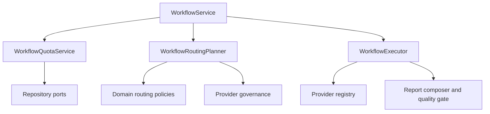
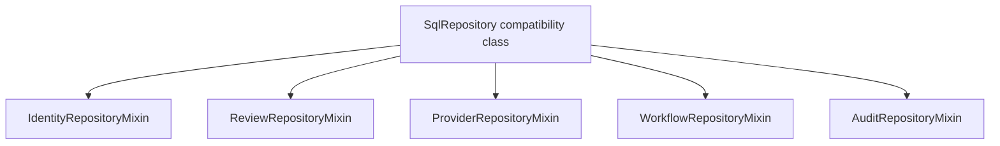

# Engineering Principles

This project is built as defensive decision-support software. The engineering rules below are release criteria, not aspirational slogans.

## Maintainability Position

The codebase is currently structured as a modular monolith:

- `apps/api/app/domain`: domain policies, enums, routing decisions and exceptions;
- `apps/api/app/application`: use-case services and ports;
- `apps/api/app/interfaces`: FastAPI routes, request/response schemas and dependency wiring;
- `apps/api/app/infrastructure`: SQLAlchemy repositories, provider adapters, storage, notifications, ingestion and security adapters;
- `apps/web/src/features`: feature-oriented React screens and flows;
- `packages/contracts`: generated OpenAPI contract.

The dependency rule is:



Domain and application code must not depend on FastAPI, SQLAlchemy ORM models, React internals, Celery, provider SDKs or concrete storage clients.

## SOLID Principles In This Codebase

SOLID is applied pragmatically. The goal is simpler change, not needless abstraction.

### Single Responsibility

Routes handle HTTP concerns. Application services enforce business rules. Repositories perform persistence. Provider adapters isolate external model-provider behaviour. Ingestion helpers isolate parser and network concerns.

Examples:

- auth route functions parse requests and set cookies;
- `AuthService` handles registration, verification, login and reset rules;
- repository classes own database reads and writes;
- provider adapters own provider-specific request and catalogue behaviour.

The current workflow split is:



The current SQL persistence split is:



### Open Closed

The provider registry and adapter schemas allow new provider adapters without changing workflow business logic. Agent routing uses specialist metadata and context-pack selection rather than hard-coded prompt branches in route handlers.

### Liskov Substitution

Ports define expected behaviour for providers, repositories, credentials, notifications and search. Any implementation must preserve the same contract, including failure behaviour and security constraints.

### Interface Segregation

Ports are intentionally small. A provider adapter exposes schema, connection test, catalogue, capability probe and generation behaviours. Notification and credential ports do not know about database or route details.

### Dependency Inversion

Application services depend on ports and domain policies. Infrastructure implements those ports. This keeps vendor SDKs, database sessions and network clients at the edge.

## Secure By Design Position

The default posture is fail closed:

- production startup rejects unsafe configuration;
- deterministic test adapters are disabled in production;
- verification and password-reset tokens are not returned in production;
- cookies are HttpOnly and secure in production;
- CORS must be HTTPS and explicit in production;
- SMTP is required in production;
- Cloudflare Turnstile is required by the hardened production profile;
- provider endpoint validation blocks private, loopback, link-local, reserved and metadata targets;
- local self-hosted provider mode must be explicitly enabled before private endpoints are allowed;
- uploaded files, websites, repositories, OCR text, transcripts and model output are treated as untrusted;
- source ingestion enforces size, path, redirect and parser limits;
- object and action authorisation is checked in application services;
- workspace and project boundaries are checked before data access;
- API tokens are displayed once and stored only as hashes;
- webhook payloads use timestamped HMAC verification and replay controls;
- sensitive account changes invalidate sessions.

Security does not rely on model prompts. Prompts can guide analysis, but deterministic code enforces authentication, authorisation, routing, data classification, provider policy, quotas and egress controls.

## File Size And Readability

The project policy is:

- target hand-written source files under 350 physical lines;
- treat 400 lines as the hard exceptional upper bound;
- exclude generated files, lockfiles, migrations and Markdown from the source-size gate.

The enforced script is:

```powershell
python scripts\check_line_lengths.py
```

It warns for files over 350 lines and fails files over 400 lines. Files over 350 lines should be reviewed before adding more logic. Tests may occasionally be near the upper band, but product code should be split by responsibility when practical.

## Documentation Rules

Documentation should be factual and operational. It should avoid marketing language and explain:

- local setup;
- production deployment;
- account types and quotas;
- provider and model behaviour;
- security posture;
- known limitations;
- verification commands;
- recovery and rollback steps.

Markdown files are not subject to the 400-line source-file limit because detailed setup and operations guides are expected to be longer.

## Quality Gates

Required gates for non-trivial changes:

```powershell
.\.venv\Scripts\python -m pytest apps\api
.\.venv\Scripts\python -m mypy apps\api\app
.\.venv\Scripts\python -m ruff check apps\api scripts
npm run typecheck --prefix apps/web
npm run test:coverage --prefix apps/web
npm run build --prefix apps/web
python scripts\check_line_lengths.py
python scripts\secret_scan.py
```

Security gates:

```powershell
.\.venv\Scripts\python -m bandit -q -r apps\api\app
.\.venv\Scripts\python -m pip_audit -r apps\api\requirements.txt
.\.venv\Scripts\python -m pip_audit -r apps\api\requirements-dev.txt
npm audit --prefix apps/web --audit-level=moderate
```

Container and deployment gates:

```powershell
docker compose config
$env:APP_ENV_FILE = ".env.production.example"
docker compose --env-file deploy\cheap-vps\.env.production.example -f deploy\cheap-vps\docker-compose.prod.yml config
Remove-Item Env:APP_ENV_FILE
```

## Definition Of Done For SOLID Hardening

A SOLID hardening pass is complete only when:

- the changed module has one clear reason to change, or has been split so each new module does;
- dependency direction remains `interfaces/infrastructure -> application -> domain`;
- domain and application code import no FastAPI, SQLAlchemy, Celery, provider SDK or concrete infrastructure modules;
- new extension points are expressed as application ports when they cross storage, auth, provider, ingestion or notification boundaries;
- changed frontend screens keep orchestration separate from panel-level rendering;
- `python scripts\check_line_lengths.py` reports no hard failures;
- backend tests, backend typing, backend lint, frontend tests, frontend typing, frontend build and the secret scan pass before release.

## Current Assessment

The current codebase is broadly aligned with SOLID and secure-by-design principles:

- route handlers are mostly thin;
- application services hold business rules;
- provider, search, storage, notification and persistence behaviour are behind adapters or ports;
- MFA and external-source ingestion are injected through application ports rather than imported directly by application services;
- `ProviderSettings.tsx` is split into panel components while retaining top-level orchestration;
- `SqlRepository` is a compatibility class composed from focused identity, review, provider, workflow and audit mixins;
- `WorkflowService` delegates quota, routing and execution concerns to dedicated collaborators;
- architecture tests enforce application/domain dependency direction;
- production settings fail closed;
- security-sensitive behaviours have regression tests;
- no hand-written source file exceeds the hard 400-line limit.

Known maintainability risks to monitor:

- several existing frontend test/support files and a few adapters sit above the 350-line warning target, though below 400;
- future persistence additions should go into the relevant focused repository mixin or a new narrow adapter, not into `SqlRepository`;
- high-volume production should move from the local background runner shape to a dedicated queue worker and stronger observability.
