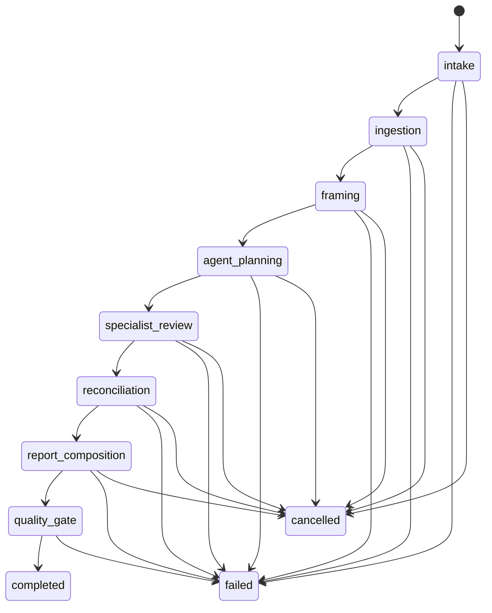

# Stage 1 Workflow State Model

Review runs move through deterministic states:

Starting a run persists an `intake` run and queues background execution. The executor commits each state transition and checks for cancellation before advancing, so a queued or in-flight run can stop before report creation.

Events are persisted to `RunEvent` before they are streamed, so refreshing the running screen can replay the timeline.
