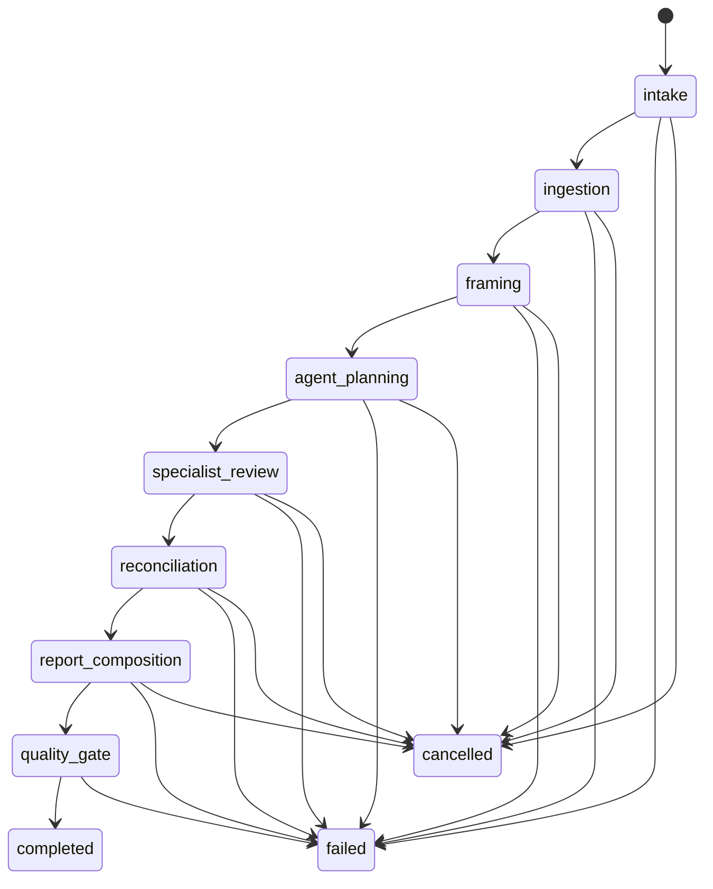

# Stage 2 Workflow State Model

Review runs still move through deterministic states. Stage 2 enriches each state with research, model-diversity and evaluation metadata rather than changing the durable state names:

Starting a run persists an `intake` run and queues background execution. The executor commits each state transition and checks for cancellation before advancing, so a queued or in-flight run can stop before report creation.

Events are persisted to `RunEvent` before they are streamed, so refreshing the running screen can replay the timeline.

## Stage 2 State Responsibilities

- `ingestion`: verifies rich source extraction, website snapshots, code manifests, transcript warnings and source locator coverage.
- `framing`: applies private-research policy, domain allow/block lists and source redaction decisions.
- `agent_planning`: selects from the full specialist registry and records model-diversity or fallback decisions.
- `specialist_review`: validates specialist outputs, cross-agent disagreements, pre-mortem inputs and scenario sections.
- `reconciliation`: detects duplicate findings, contradictions, changed risks and action candidates.
- `report_composition`: creates advanced report sections, comparison summaries, action tracking and PDF-safe content.
- `quality_gate`: checks citations, unsupported claims, locator accuracy, external research policy and deterministic evaluation metrics.

Background jobs remain idempotent by state: re-executing a terminal run is a no-op, and re-executing an in-flight run advances only missing downstream states.

Each run records a retry-policy snapshot in its routing plan. Transient classes such as provider timeouts, rate limits and temporary storage failures are retryable with bounded attempts. Permanent classes such as schema validation failures, report quality-gate failures, policy denials and unsupported sources fail closed until the user changes the underlying input or configuration.
