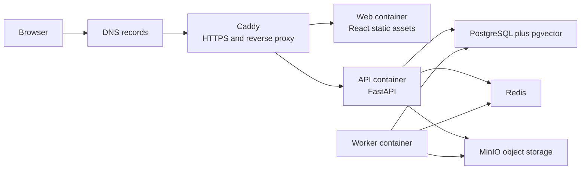

# VPS And Domain Production Deployment

This guide is the operational deployment path for a single VPS with a custom domain. It uses Docker Compose, Caddy automatic HTTPS, PostgreSQL, Redis and MinIO on private Docker networks.

The current production reference is `redteamagent.co.uk`, but the same procedure works for another domain.

## Production Architecture



Only ports `80/tcp`, `443/tcp` and SSH should be reachable from the public internet. PostgreSQL, Redis and MinIO are internal services.

## DNS

At your registrar or DNS provider:

| Record | Name | Value |
|---|---|---|
| `A` | `@` | VPS IPv4 address |
| `AAAA` | `@` | VPS IPv6 address, only if configured |
| `CNAME` | `www` | apex domain, for example `redteamagent.co.uk` |

If the DNS provider does not allow a `CNAME` for `www`, use an `A` record to the same VPS IPv4.

## First Server Setup

SSH into the VPS, then install Docker and supporting tools:

```bash
sudo apt update
sudo apt install -y ca-certificates curl git ufw openssl
curl -fsSL https://get.docker.com | sudo sh
sudo usermod -aG docker "$USER"
newgrp docker
```

Clone the repository:

```bash
cd /opt
git clone https://github.com/ShabalalaWATP/RedTeamAgent.git
cd /opt/RedTeamAgent/deploy/cheap-vps
cp .env.production.example .env.production
chmod 600 .env.production
```

## Production Environment

Edit the ignored production env file:

```bash
nano /opt/RedTeamAgent/deploy/cheap-vps/.env.production
```

Required production values:

```env
DOMAIN_NAME=redteamagent.co.uk www.redteamagent.co.uk
ACME_EMAIL=admin@redteamagent.co.uk
APP_ENV=production
APP_SECRET_KEY=<32-plus-random-characters>
COOKIE_SECURE=true
CORS_ORIGINS=https://redteamagent.co.uk,https://www.redteamagent.co.uk
PUBLIC_APP_URL=https://redteamagent.co.uk
PRIVILEGED_MFA_REQUIRED=true
WEBAUTHN_RP_ID=redteamagent.co.uk
WEBAUTHN_RP_NAME=RedTeamAgent
CAPTCHA_REQUIRED=true
CAPTCHA_PROVIDER=turnstile
TURNSTILE_SECRET_KEY=<private-turnstile-secret>
VITE_TURNSTILE_SITE_KEY=<public-turnstile-site-key>
SITE_OWNER_BOOTSTRAP_TOKEN=<32-plus-random-characters>
ALLOW_FAKE_PROVIDER=false
EXPOSE_AUTH_TOKENS=false
AUTO_BOOTSTRAP_SITE_OWNER=false
MAIL_DELIVERY=smtp
SMTP_HOST=<smtp-host>
SMTP_PORT=587
SMTP_USERNAME=<smtp-username>
SMTP_PASSWORD=<smtp-password>
SMTP_STARTTLS=true
```

Generate random values on the server:

```bash
openssl rand -hex 32
```

Do not paste real secrets into `.env.production.example`, GitHub issues, logs or documentation.

## Turnstile CAPTCHA

Create a Cloudflare Turnstile widget for:

- `redteamagent.co.uk`
- `www.redteamagent.co.uk`

Use:

```env
CAPTCHA_PROVIDER=turnstile
TURNSTILE_SECRET_KEY=<secret key>
VITE_TURNSTILE_SITE_KEY=<site key>
```

The site key is public and is baked into the frontend image at build time. The secret key stays server-side in `.env.production`.

After changing `VITE_TURNSTILE_SITE_KEY`, rebuild the `web` image. A restart alone is not enough.

## Firewall

```bash
sudo ufw default deny incoming
sudo ufw default allow outgoing
sudo ufw allow OpenSSH
sudo ufw allow 80/tcp
sudo ufw allow 443/tcp
sudo ufw enable
sudo ufw status verbose
```

## Deploy

From `/opt/RedTeamAgent`:

```bash
git fetch origin main
git pull --ff-only origin main
cd /opt/RedTeamAgent/deploy/cheap-vps
APP_ENV_FILE=.env.production docker compose --env-file .env.production -f docker-compose.prod.yml config >/tmp/rta-compose-config.txt
docker compose --env-file .env.production -f docker-compose.prod.yml build api worker web
docker compose --env-file .env.production -f docker-compose.prod.yml run --rm --no-deps api python -c "from app.core.config import get_settings, validate_production_settings; validate_production_settings(get_settings()); print('production settings valid')"
docker compose --env-file .env.production -f docker-compose.prod.yml up -d --force-recreate api worker web caddy
docker compose --env-file .env.production -f docker-compose.prod.yml ps
```

## Verify

From your workstation:

```powershell
curl.exe -I http://redteamagent.co.uk/
curl.exe -I https://redteamagent.co.uk/auth
curl.exe -fsS https://redteamagent.co.uk/api/health
```

Expected:

- HTTP returns a permanent redirect to HTTPS.
- `/auth` returns `200 OK`.
- `/api/health` returns `{"status":"ok"}`.
- Security headers include CSP, HSTS, `X-Content-Type-Options` and `frame-ancestors 'none'`.

On the VPS:

```bash
cd /opt/RedTeamAgent/deploy/cheap-vps
docker compose --env-file .env.production -f docker-compose.prod.yml ps
docker compose --env-file .env.production -f docker-compose.prod.yml logs --tail=120 api worker web caddy
```

## Updates

Use fast-forward deploys from `main`:

```bash
cd /opt/RedTeamAgent
git fetch origin main
git pull --ff-only origin main
cd deploy/cheap-vps
docker compose --env-file .env.production -f docker-compose.prod.yml build api worker web
docker compose --env-file .env.production -f docker-compose.prod.yml up -d --force-recreate api worker web caddy
```

## Backups

Before onboarding real users:

1. Back up PostgreSQL daily with `pg_dump`.
2. Back up MinIO object storage.
3. Back up `.env.production` to encrypted storage.
4. Test restore into a staging VPS.
5. Record restore dates, checksums and operator notes.

Example database backup:

```bash
cd /opt/RedTeamAgent/deploy/cheap-vps
mkdir -p backups
docker compose --env-file .env.production -f docker-compose.prod.yml exec -T postgres pg_dump -U "$POSTGRES_USER" "$POSTGRES_DB" > "backups/redteam-$(date +%Y%m%d-%H%M%S).sql"
```

## Operational Caveats

- A single VPS is acceptable for a small early production deployment, but it is not high availability.
- Move PostgreSQL and object storage to managed services before storing substantial confidential user data.
- Use SSH keys and disable password login after emergency access is stable.
- Configure SPF, DKIM and DMARC for the sending mail domain before higher-volume email.
- Forward audit events to append-only storage before relying on them as tamper-evident records.
